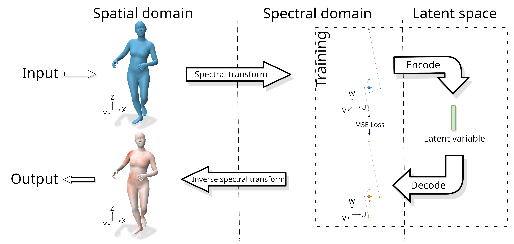

# Representation learning of 3d meshes using an Autoencoder in the spectral domain

This repository contains the PyTorch implementation of the paper **Representation learning of 3d meshes using an Autoencoder in the spectral domain** by *Clément Lemeunier, Florence Denis, Guillaume Lavoué and Florent Dupont*.



## Setup

The code was tested on Linux with PyTorch 1.12.0, CUDA 10.2 and Python 3.10.

Create a conda environment and activate it:
```
conda create -n spectral_learning python=3.10
conda activate spectral_learning
```

Install [PyTorch](https://pytorch.org/get-started/locally/).

Install requirements:
```
pip install -r requirements.txt
```

## Datasets

Download [this archive](https://drive.google.com/file/d/15SEcFzMsfUwCyPqbRUYgd0hUp67KSeiB/view?usp=sharing) and extract it to the root folder. 

It contains :
- the SMPL connectivity with its eigenvectors computed with [Matlab](https://fr.mathworks.com/products/matlab.html)
- our [AMASS](https://amass.is.tue.mpg.de/) dataset
- our [DFAUST](https://dfaust.is.tue.mpg.de/) dataset

Both datasets use the [WebDataset](https://github.com/webdataset/webdataset) format. They contain only the spectral coefficients for the train sets and the spectral coefficients + the vertices for the test sets. Details on datasets are given in the paper.

## Train a new model

In order to train a model, execute the following command specifying a `job_id` like `python train.py --job_id=0` or `python train.py --job_id=SAE`. Training is done using the framework PyTorch Lightning. It will create a new folder in the `checkpoints/` directory and create logs in a folder `tb_logs/`, which you can visualize using the command `tensorboard --logdir tb_logs`. The results in the paper were obtained using the options `deterministic=False` and `benchmark=True` for better performance. Reconstruction results of newly trained models can therefore differ by a small margin. 

## Reproducibility - Evaluate a pretrained model

A pretrained model is available in the `checkpoints/SAE-LP-4096-16/` directory and corresponds to the *Spectral Autoencoder with Learned Pooling using 4096 frequencies and a latent space of size 16*. In both evaluation scripts (`eval_accuracy.py` and `app_polyscope.py`), the model is loaded using `load_trainer("SAE-LP-4096-16")`.

It is possible to: 
- evaluate the model's reconstruction score on the test dataset (`python eval_accuracy.py`), in order to reproduce the value presented in the Figure 6 of the paper for the SAE-LP-4096, AMASS dataset and a latent size of 16. 
- visualize its ability to reconstruct/interpolate meshes (`python app_polyscope.py`) using [Polyscope](https://polyscope.run/py/). In order to reproduce the first and last line of Figure 11 of the paper, you need to launch this script and click on `Load interp` (indices for both meshes are already set to 10 for `Index 0` and 871 for `Index 1` corresponding to meshes presented in the Figure).

## Acknowledgements
This work was supported by the ANR project Human4D ANR-19-CE23-0020.

## License
This work is Copyright of University of Lyon, 2022. It is distributed under the Mozilla Public License v. 2.0. (refer to the accompanying file LICENSE-MPL2.txt or a copy at http://mozilla.org/MPL/2.0/).