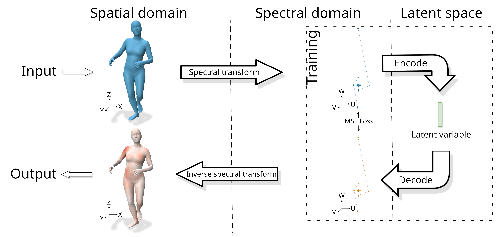

# Representation learning of 3d meshes using an Autoencoder in the spectral domain

This repository contains the PyTorch implementation of the paper **Representation learning of 3d meshes using an Autoencoder in the spectral domain** by *Clément Lemeunier, Florence Denis, Guillaume Lavoué and Florent Dupont*.



## Setup

Create conda environment and install packages: 
- `conda create -n spectral_learning python=3.9`
- `conda activate spectral_learning`
- `pip install torch torchvision torchaudio --index-url https://download.pytorch.org/whl/cu121`
- `pip install smplx[all]`
- `pip install tqdm`
- `pip install lightning`
- `pip install -U 'tensorboard'`
- `pip install polyscope`

Following [this thread](https://github.com/vchoutas/smplx/issues/109), go this file your conda env: `...\envs\spectral_learning_bi\lib\site-packages\smplx\body_models.py`, and replace line 144 this: 

```
print(f'WARNING: You are using a {self.name()} model, with only'
        ' 10 shape coefficients.')
num_betas = min(num_betas, 10)
```

, by this: 

```
print(f'WARNING: You are using a {self.name()} model, with only'
        f' {shapedirs.shape[-1]} shape coefficients.')
num_betas = max(num_betas, 10)
```

## Build datasets

Download [smplx.zip](https://download.is.tue.mpg.de/download.php?domain=mano&sfile=smplx.zip) archive and extract it into `data\SMPL\`. 

Download these archives from [AMASS](https://amass.is.tue.mpg.de/download.php):
- For small dataset
    - DFaust 
- For larger dataset 
    - HumanEva, MPI_HDM05, SFU, MPI_mosh, CMU, MPI_Limits, TotalCapture, Eyes_Japan_Dataset, KIT, DanceDB, BMLhandball, Transitions_mocap, EKUT, TCD_handMocap, ACCAD

Put each archive in `data/SMPL/AMASS`, and extract them so that paths are like: 
- `data\SMPL\AMASS\ACCAD\ACCAD\Female1General_c3d\A1 - Stand_poses.npz`
- `data\SMPL\AMASS\CMU\CMU\01\01_01_poses.npz`
- `data\SMPL\AMASS\KIT\KIT\3\912_3_01_poses.npz`
- etc...

Launch the command `python dataset_construction/get_smpl_connectivity.py` to get SMPL triangulation as a `txt` file (`data\SMPL\smpl_faces.txt`)

In Matlab (MATLAB Online is available for free 20 hours per month), launch the script `dataset_construction\compute_GL_basis.m`, in combination with the previously created file `data\SMPL\smpl_faces.txt`. This will create `evecs_GL_6890.txt` containing eigenvectors computed from the Graph Laplacian of the SMPL connectivity. Put this file in `data\SMPL\evecs_GL_6890.txt`. All bases are computed, but less are used to train the neural network, 4096 for example.

Launch the commands: 
- `python dataset_construction/construct_DFaust_dataset.py` to create the smaller dataset
- `python dataset_construction/construct_AMASS_dataset.py` to create the bigger dataset

Both scripts will convert the eigenvectors from `txt` format to `npy` (you can then delete the `txt` file).


## Train a new model

In order to train a model, execute the following command specifying a `job_id` like `python train.py --job_id=0` or `python train.py --job_id=SAE`. Training is done using the framework PyTorch Lightning. It will create a new folder in the `checkpoints/` directory and create logs in a folder `tb_logs/`, which you can visualize using the command `tensorboard --logdir tb_logs`. The results in the paper were obtained using the options `deterministic=False` and `benchmark=True` for better performance. Reconstruction results of newly trained models can therefore differ. 

## Reproducibility - Evaluate a pretrained model

A pretrained model is available in the `checkpoints/SAE-LP-4096-16/` directory and corresponds to the *Spectral Autoencoder with Learned Pooling using 4096 frequencies and a latent space of size 16*. In both evaluation scripts (`eval_accuracy.py` and `app_polyscope.py`), the model is loaded using `load_trainer("SAE-LP-4096-16")`.

It is possible to: 
- evaluate the model's reconstruction score on the test dataset (`python eval_accuracy.py`), in order to reproduce the value presented in the Figure 6 of the paper for the SAE-LP-4096, AMASS dataset and a latent size of 16. 
- visualize its ability to reconstruct/interpolate meshes (`python app_polyscope.py`) using [Polyscope](https://polyscope.run/py/). It is also possible to compare the interpolation between two meshes in the latent space and in spatial space by clicking on `Load interp`.

## Acknowledgements
This work was supported by the ANR project Human4D ANR-19-CE23-0020.

## License
This work is Copyright of University of Lyon, 2022. It is distributed under the Mozilla Public License v. 2.0. (refer to the accompanying file LICENSE-MPL2.txt or a copy at http://mozilla.org/MPL/2.0/).
